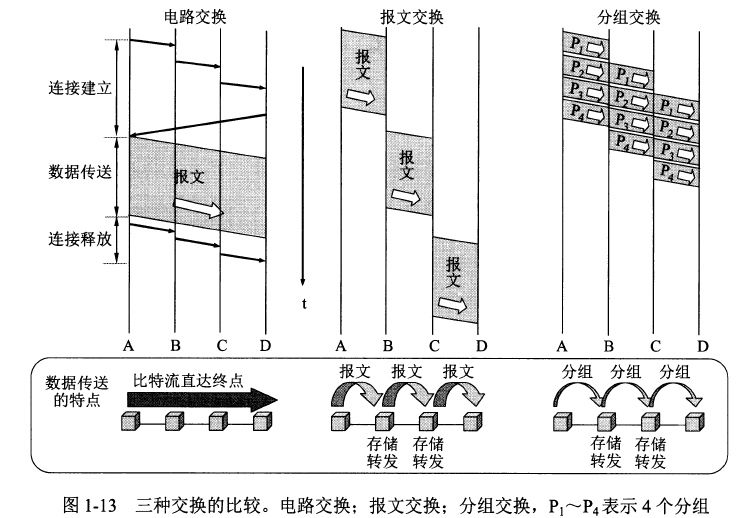
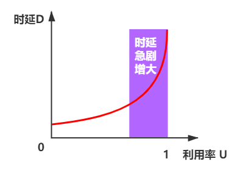

# 第1章 概述

## 计算机网络在信息时代的作用

常见的网络分为三大类：
- 电信网络
- 有线电视网络
- 计算机网络

其中 **计算机网络** 是核心

互联网即因特网，是 *Internet* 的译名

> [!Attention]
> 注意区分 Internet 和 internet
> - internet：是一个通用名词，泛指多个计算机网络互连而成的网络
> - Internet：是一个专用名词，特指因特网--世界上最大的计算机网络

互联网的两个基本特点：
- 连通性
- 共享性

互联网+：指的是 互联网 + 各个传统行业

## 互联网概述

### 网络的网络

计算机网络由 **多个结点和连接结点的链路** 组成。结点可以是 **计算机、集线器或路由器** 等
网络之间可以通过 **路由器** 互连起来，构成 **网络的网络**，称为 **互联网**

- 网络将许多计算机连接在一起
- 互联网则把网络通过路由器连在一起

与网络相连的计算机称为 **主机**

### 互联网基础结构发展的三个阶段

因特网发展的三个阶段
- **第一阶段**：从单个网络 *ARPANET* 向互联网发展的过程。1983 年 *TCP/IP* 协议成为 *ARPANET* 上的标准协议。
- **第二阶段**：建成三级结构的因特网：主干网、地区网和校园网（或企业网）。
- 形成多层次的ISP（*Internet Service Provider* 因特网服务提供者）结构的因特网

> [!tip]
> ISP（*Internet Service Provider* 因特网服务提供者）
> 
> 常见的如中国电信、中国移动和中国联通都是 *ISP*
> 
> 上网就是指接入到互联网。主机必须有 *IP* 地址才能上网。
> *ISP* 从互联网管理机构申请到很多 *IP* 地址，同时拥有通信线路及路由器等联网设备。
> 用户向 *ISP* 交纳费用获得所需 *IP* 地址的使用权，然后就可以通过该 *ISP* 接入互联网。
> 
> 互联网由全球无数的 *ISP* 所共同拥有。
> **万维网**（WWW） 是基于互联网开发的一种信息共享服务，浏览网址一般使用的就是万维网，而邮件等就没有用到万维网。

### 互联网标准化工作

标准的分类
- **法定标准**：由权威机构指定的正式的、合法的标准，如 *OSI*
- **事实标准**：某些公司的产品在竞争中占据主流，时间长了这些产品中的协议和技术就成了标准，如 *TCP/IP*

> *RFC（request for comments）*

*RFC* 是因特网标准的形式，*RFC* 要上升为因特网正式标准的四个阶段：
1. **因特网草案（*Internet Draft*）**：这个阶段还不是 *RFC* 文档
2. **建议标准（*Proposed Standard*）**：这个阶段开始正式成为 *RFC* 文档
3. **草案标准（*Draft Standard*）**：将 *RFC* 文档交由 *IETF* 和 *IAB* 进行审核，已将取消此步骤
4. **因特网标准（*Internet Standard*）**

> 标准化工作的相关组织

- 国际标准化组织 *ISO*：*OSI* 参考模型，*HDLC* 协议
- 国际电信联盟：指定通信规则
- 国际电气电子工程师协会 *IEEE*：学术机构，*IEEE802* 系列标准，*5G* 协议的制定
- *Internet* 工程任务组 *IETF*：复制因特网相关标准的制定，*RFC xxx*

## 互联网的组成

互联网按照工作方式划分为 **边缘部分** 和 **核心部分**
- **边缘部分**：由连接到互联网的主机组成，作用是 **进行信息处理**
- **核心部分**：由大量网络和连接网络的路由器组成，作用是 **按存储转发的方式进行分组交换**，为边缘部分提供通信服务

### 互联网的边缘部分

**主机** 又称作 **端系统**（个人电脑，手机，摄像头等都属于端系统）

边缘部分利用核心部分提供的服务进行通信，一般称为 **计算机间的通信**

计算机之间的通信：实际上是 **不同计算机上某个进程之间的通信**

通信方法主要有两类：
- **客户-服务器** 方式
  - 客户程序：
    - 用户调用后，在通信时主动向远地服务器发起通信（请求服务）。因此，**客户程序必须知道服务器程序的地址**
    - 不需要特殊的硬件和复杂的操作系统
  - 服务器程序：
    - 一种专门提供服务的程序，可 **同时处理多个客户的请求**
    - 系统启动后即自动调用不断运行，**被动** 等待接受客户的通信请求。因此，**服务器程序不需要知道客户程序的地址**
    - 一般需要强大的硬件和操作系统支持
- **对等** 方式（*p2p*）
  - 两台主机不区分服务器和客户，主要都运行 *p2p* 软件，就可以进行 **平等对等连接通信**，双方都可以访问对方硬盘中的共享文档，可支持大量对等用户同时工作

> [!tip]
> 客户-服务器方式
> 
> 一方请求服务，一方提供服务，通信可以是单向的，也可以是双向的
> 
> 客户和服务器：指通信中涉及的两个 **应用进程**，客户是服务请求方，服务器是服务提供方

### 互联网的核心部分

核心部分最重要的功能是 **分组交换**，其主要组件时 **路由器**（用于转发分组）

> **分组交换**
> 
> 要发送的整块数据 称为一个 **报文**，将报文分成多个数据段，每个数据段加上一个 **首部（报头）** 构成一个 **分组（包）**
> 
> 分组交换采用 **存储转发技术**：路由器接到分组后，先暂时存储，检查首部，查找转发表，然后按照首部中的目的地址，找到合适的接口转发给下一个路由器，这样一步步的交付给最终的目的主机
> 
> **首部** 中主要包含 **目的地址、源地址** 等控制信息
> 
> 分组是在互联网中传送数据的单元

### 三种交换方式
- **电路交换**：三个步骤
  1. 建立连接（占用通信资源 ，一条专用的物理通路）
  2. 通话（一直占用通信资源）
  3. 释放连接（归还通信资源）
  - 缺点：在通话的全部时间始终占用端到端的通信资源
  - 应用：电话使用的就是电路交换，而互联网数据因为其 **突发性**，使用电路交换的话效率很低
- **报文交换**：整个报文先传送到相邻结点，全部存储下来后查找转发表，转发到下一个结点
- **分组交换**：单个分组传送到相邻结点，存储下来后查找转发表，转发到下一结点

## 计算机网络的类别

> 按照网络的 **作用范围** 分类

- **广域网** *（WAN）*：作用范围几十到几千公里，是互联网的核心部分，其任务是通过长距离运送主机所发送的数据，广域网各结点采用高速链路，有较大通信容量
- **城域网** *（ MAN）*：作用范围一个城市，用来将多个局域网进行互联，多采用以太网技术
- **局域网** *（LAN）*：作用范围1km左右，一般用微机或工作站通过高速通信线路相连
- **个人区域网** *（PAN）*：作用范围10m左右，把个人工作的地方属于个人的设备用无线技术相连，也叫 **无线个人区域网** *(WPAN)*

> 按照网络的 **使用者** 分类

- **公用网**：电信公司出资建造的大型网络，任何人都可付费使用，也称 **公众网**
- **专用网**：为满足特殊业务需要建立的网络，不向外人提供服务
- **接入网**：用来把用户进入到互联网的网络，又称 **本地接入网** 或 **居民接入网**

## 计算机网络性能

**性能指标** 是从定量来描述计算机通信网络的特征

**非性能特征** 是从定性来描述计算机通信网络的特征

### 计算机网络的性能指标

> 速率

**速率** 是指连接在计算机网络上的主机在数字信道上传送数据的速率。是计算机网络中最重要的一个性能指标。

速率又称 **数据率** *（data rate）* 或 **比特率** *（bit rate）*，单位是 $bit/s$ （比特每秒）

当速率较高时，常常在 $bit/s$ 前加上一个字母，例如 $k(kilo)=10^3$，$M(Mega)=10^6$，$G(Giga)=10^9$

> [!ATTENTION]
> 速率往往指额定速率或标称速率，并非网络上实际运行的速率

> 带宽

- 带宽：本意是指某个信号具有的 **频带宽度**，信号的带宽是指该信号所包含的各种不同频率成分所占据的频率范围。
- 在计算机网络中，**带宽指网络的通信线路传送数据的能力**（单位时间内从网络中的某一个点到另外一个点所能通过的 **最高数据率**,带宽的单位为 $bit/s$）。

> [!tip]
> 带宽有两种不同的意义，在上述描述中，前者为 **频域称谓**，后者为 **时域称谓**，但其本质是相同的。也就是说，**一条通信链路，带宽越宽，所能传输的最高数据率也越高。**

> 吞吐量

- 吞吐量表示单位时间内通过某个网络（通信线路、接口）的实际的数据量。单位为 $bit/s$
- 吞吐量受制于带宽或者网络的额定速率。

例如：对于一个1Gbit/s的以太网，意味着其额定速率为1Gbit/s，那么这个数值也是该以太网的吞吐量的绝对上限值。

> 时延

时延（*delay* 或 *latency*）是指数据（一个报文或分组，甚至比特）从网络(或链路)的一端传送到另一端所需的 **时间**。有时也称为延迟或迟延。

时延由以下几个部分组成

| 时延类型 |                             解释                             |
| :------: | :----------------------------------------------------------: |
| 发送时延 |              主机或路由器发送数据帧所需要的时间              |
| 传播时延 |          电磁波在信道中传播一定的距离需要花费的时间          |
| 处理时延 |       主机或者路由器接受到分组时要花费一定的时间去处理       |
| 排队时延 | 分组在网络传输时，进入路由器后要在输入队列中排队等待处理， 路由器确定转发接口后，还要在输出队列中排队等待转发，这就是排队时延 |

- **发送时延**：是从发送数据帧的第一个比特算起,到该帧的最后一个比特发送完毕所需的时间，计算公式：$\displaystyle \text{发送时延}=\frac{\text{数据数据帧长度(比特)}}{\text{发送速率(比特/秒)}}$
- **传播时延**：计算公式：$\displaystyle \text{传播时延}=\frac{\text{信道长度(米)}}{\text{信号在信道上的传播速率(米/秒)}}$
- **处理时延**：与结点的性能和处理方法有关。
- **排队时延**：排队时延的长短往往取决于网络中当时的通信量。**当网络的通信量很大时若发生队列溢出，使分组丢失，相当于排队时延为无穷大。**

总时延 = 发送时延 + 传播时延 + 处理时延 + 排队时延

> [!tip]
> **发送速率** 和 **传播速率**
> 
> 对于高速网络链路，我们提高的不是比特在链路上的传播速率，而是数据的发送速率。
> 
> 载荷信息的电磁波在通信线路上的传播速率取决于通信线路的介质材料。提高数据的发送速率只是减少了数据的发送时延。
> 
> 因此
> 
> 我们通常所说的”光纤信道的传输速率高“是指可以用很高的速率向光纤信道发送数据，而光纤信道的传播速率实际上还要比铜线的传播速率略低一点。

> 时延带宽积

时延带宽积指 **传播时延\*带宽**，表示一条链路上传播的所有比特（以比特为单位）。

链路的时延带宽积又称为以比特为单位的链路长度

> 往返时间 *RTT*

往返时间 *RTT (Round-Trip Time)* 表示从发送端发送数据开始，到发送端收到来自接收端的确认（接收端收到数据后立即发送确认），总共经历的时延。

> 利用率

- 信道利用率指出某信道有百分之几的时间是被利用的（有数据通过）。完全空闲的信道的利用率是零
- 网络利用率则是全网络的信道利用率的加权平均值。
- **信道利用率并非越高越好。**

根据排队论的理论，当某信道的利用率增大时，该信道引起的时延也迅速增加。

令 $D_0$ 表示网络空闲时的时延，$D$ 表示网络当前的时延，那么在适当的假定条件下，可以用下面的简单公式来表示 $D$，$D_0$ 和利用率 $U$ 之间的关系
$$
D = \frac{D_0}{1-U}
$$

其中 $U$ 是网络利用率，数值介于 $0$ 和 $1$ 之间

> [!ATTENTION] 
> 当网络的利用率达到其容量的 $1/2$ 时，时延就要加倍。且，当网络的利用率接近最大值 $1$ 时，网络的时延就趋于无穷大。
> 
> 信道利用率过高会产生非常大的时延

### 计算机网络的非性能指标

- 费用
- 质量
- 标准化
- 可靠性
- 可扩展性和可升级性
- 易于管理和维护
- ...

## 计算机网络体系结构
