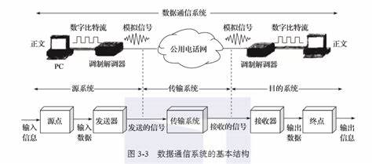
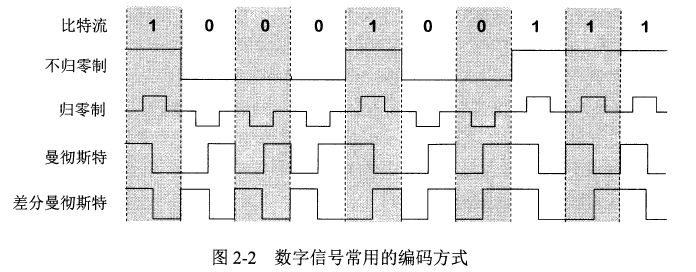
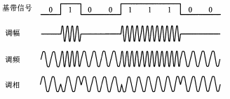
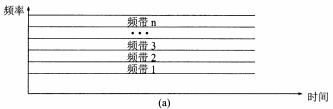
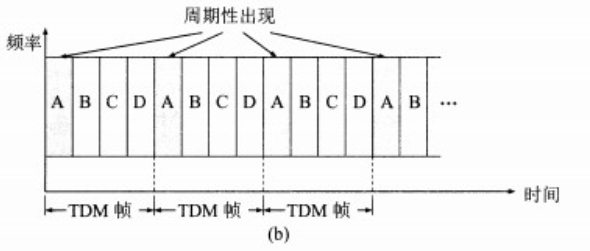
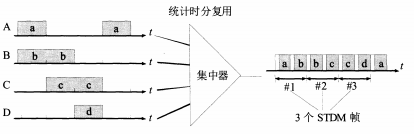
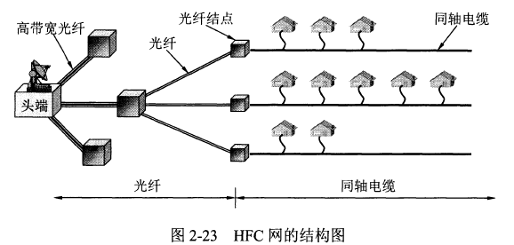

# 第2章 物理层

## 物理层基本概念

物理层关注的是 **如何在连接各种计算机的传输媒体上传输数据流**。

物理层的任务是尽可能屏蔽掉不同传输媒体和通信手段间的差异，使链路层感受不到这种差异。

> **物理层主要任务**：确定与传输媒体的接口有关的一些特性
> 
> - **机械特性**：指明接口所用接线器的形状、尺寸等机械特性。
> - **电气特性**：指明接口电缆的各条线上的电压的范围。
> - **功能特性**：指明电线上某一电平的电压的意义。
> - **过程特性**：指明不同功能的各种可能事件的出现顺序。

数据在计算机内部一般是 **并行传输**，但 **在通信线路上是串行传输**，所以物理层还要完成传输方式的转换。

物理层协议很多，因为物理连接的方式很多，传输媒体的种类也很多。

## 数据通信基础知识

### 数据通信系统模型

通信的目的是传送消息，**数据是运送消息的实体**，**信号是数据的电气或电磁的表现**。

如下图，一个数据通信系统可划分为 **源系统**、**传输系统**、**目的系统**，或称为发送端、传输网络、接收端。

- 源系统包括源点和发送器。
  - **源点**：源点设备产生要传输的数据
  - **发送器**：源点生成的数字比特流要通过发送器编码后才能在传输系统中传输；如 **调制器**
- 目的系统包括接收器和终点。
  - **接收器**：接收传输系统发送来的信号，并转换成能被目的设备处理的信息；如 **解调器**
  - **终点**：终点设备从接收器获取传送来的数字比特流，然后把信息输出

> [!tip]
> 一些常用术语：
> 
> - **消息**：通信的目的是传送消息，如语音、文字、图像、视频等
> - **数据**：是运送消息的实体；使用特定方式表示的信息，通常是有意义的符号序列
> - **信号**：数据的电气或电磁表现
>   - **模拟信号**(连续信号)：代表消息的参数取值是连续的
>   - **数字信号**(离散信号)：代表消息的参数的取值是离散的
>       - **码元**：代表不同离散数值的基本波形

### 有关信道的基本概念

> 信道不等于电路，**信道表示向某一方向传送信息的媒体**，一条通信电路通常包含一条发送信道和一条接受信道。

#### 通信方式

信息交互有以下三种基本方式：
- **单向通信**，又称 **单工通信**。如有线电广播等。需要一条信道。
- **双向交替通信**，又称 **半双工通信**。需要两条信道。
- **双向同时通信**，又称 **全双工通信**。需要两条信道。

### 调制

来自信源的信号称为 **基带信号**，因为基带信号中包含较多低频成分，而 **许多信道不能传输低频分量和直流分量**，所以需要 **对基带信号调制**。

调制可分为以下两大类：
- **基带调制**：将数字信号转换为另一种数字信号。又称 **编码**。
- **带通调制**：将基带信号的频率范围转换为另一频段，并化为模拟信号。

#### 常用编码方式：

- **不归零制**：正电平代表1，负电平代表0。
- **归零制**：正脉冲代表1，负脉冲代表0。
- **曼彻斯特编码**：位周期中心的向上跳变代表0，向下跳变代表1。
- **差分曼彻斯特编码**：每一位的中心都有跳变。位开始的边界有跳变代表0，没有代表1。

> 曼彻斯特码的频率比不归零制高，但有自同步能力，即可以从信号波形自身中提取信号时钟频率

#### 基本的带通调制方法：

- **调幅**：载波的振幅随基带数字信号而变化；如0或1分别对应无载波或有载波输出
- **调频**：载波的频率随基带数字信号而变化；如0或1分别对应频率f1或f2
- **调相**：载波的初始相位随基带数字信号而变化；如0或1分别对应于相位0度或180度

### 信道的极限容量

数字通信的优点：信号在信道上传输时必然会失真，但只要能识别出原有信号，就没有影响。

传输速率越高，或距离越远，或噪声越大，失真就越严重。

限制码元在信道上传输速率的因素：
1. 信道能够通过的频率范围
2. 信噪比

#### 信道能够通过的频率范围

> 定义
> 
> 码间串扰：信号中高频分类受到衰减，在接收端收到的波形前沿和后沿不那么陡峭，每个码元所占时间界限不明确，失去了码元间的清晰界限的现象

**奈氏准则**：在任何信道，码元传输的速率是有上限的，超过上限就会出现严重的码间串扰，使接收端对码元无法识别

#### 信噪比

> 定义
> 
> 信号的平均功率和噪声的平均功率之比，记作 $S/N$，单位是分贝 $dB$
$$
 \text{信噪比}(dB) = 10\ \log_{10}(S/N)\ (dB) 
$$

> **香农公式：**
> 
> 设信道的极限信息传输速率为 $C$
> $$
> C = W\ \log_2(1+S/N)\ (bit/s)
> $$
> 其中 $W$ 为信道带宽，$S$ 为信道内所传信号的平均功率，$N$ 为信道内部的高斯噪声功率

香农公式表明，**信道的带宽或信道中的信噪比越大，信息的极限传输速率就越高**

香农公式的意义：只要信息传输速率低于信道的极限速率，就一定存在某种方法来实现无差错的传输

## 物理层下面的传输媒体

传输媒体：是数据传输系统中在发送器和接收器之间的物理通路

传输媒体分为 **导引型** 和 **非导引型** 两大类。

导引型中电磁波沿着固体媒体传播，非导引型中传输媒体就是自由空间，又称无线传输。

- **引导型**：
  - 双绞线
  - 同轴电缆
  - 光纤
- **非引导型**：
  - 电磁波无线传输

## 信道复用技术

> 信道复用技术：
> 
> 多个发送端受用同一条信道来传输信息
> 
> 发送端使用复用器将不同的信息结合起来传输，接收端使用分用器将信息分开

### 频分复用、时分复用和统计时分复用

> **频分复用** *FDM*

原理：用户在分配到一定频带后，在通信过程中自始至终都占用这个频带

特点：所有用户在同样的时间占用不同的频率带宽

> **时分复用** *TDM*

原理：将时间划分为一段段等长的时分复用帧(TDM帧)，每个时分复用的用户在每一个TDM帧中占用固定序号的时隙

特点：所有用户在不同的时间占用同样的频带宽度

> **统计时分复用** *STDM*

 原理：使用STDM帧来传送复用的数据，每一个STDM帧中的时隙数小于连接在集中器上的用户数；各用户有数据就发往集中器的输入缓存，集中器按顺序依次扫描输入缓存，把缓存中的输入数据放入STDM帧中，没有数据的缓存就跳过，当一个帧放满即发送，因此STDM帧不是固定分配时隙，而是按需动态分配时隙

某用户占用的时隙不是周期性出现的，因此统计时分复用又称为异步时分复用；而时分复用又称为同步时分复用

### 波分复用

**波分复用** *WDM* 就是 **光的频分复用**
一根光纤上可以复用几十路甚至更多的光载波信号。光信号传输一定距离后会衰减，因此需要使用 **光纤放大器** 放大后继续传输。

### 码分复用

**码分复用** *CDM*：不同用户使用不同码型，在同样时间使用同样的频带通信。

原理：各个用户使用经过特殊挑选的不同码型，因此彼此之间不会互相干扰

**码片**：每一个比特时间划分为 *m* 个短的间隔，称为码片

工作方式：每个站被指派一个 **唯一的** $m bit$ 码片
- 若发送1，则发送自己的 $m bit$ 码片
- 若发送0，则发送该码片的 **二进制反码**

码片实现扩频：由于一个比特可转换成m个比特的码片，因此实际发送数据率提高了m倍

重要特点：**每个站的码片必须各不相同，并相互正交**

> [!tip]
> 码片正交关系：不同码片正交，就是向量S和T的规格化内积为0，（规格化内积即对应为相乘）
>
> 正交关系的重要特征：任何码片与自己的规格化内积为1，与自己反码的规格化内积为-1

> 例子：
> 
> 共有四个站进行码分多址通信，四个站的码片序列分别为
>
> A(-1-1-1+1+1-1+1+1)        B(-1-1+1-1+1+1+1-1)
>
> C(-1+1-1+1+1+1-1-1)        D(-1+1-1-1-1-1+1-1)
>
> 现收到这样的码片:(-1+1-3+1-1-3+1+1)，问哪些站发送了数据，发送的是0还是1
>
> 解：
>
> A站的内积：(-1-1-1+1+1-1+1+1)*(-1+1-3+1-1-3+1+1)/8=(+1-1+3+1-1+3+1+1)/8=1
>
> B站的内积：(-1-1+1-1+1+1+1-1)*(-1+1-3+1-1-3+1+1)/8=(+1-1-3-1-1-3+1-1)/8=-1
>
> C站的内积：(-1+1-1+1+1+1-1-1)*(-1+1-3+1-1-3+1+1)/8=(+1+1+3+1-1-3-1-1)/8=0
>
> D站的内积：(-1+1-1-1-1-1+1-1)*(-1+1-3+1-1-3+1+1)/8=(+1+1+3-1+1+3+1-1)/8=1
>
> 所以A、D站发送了1，B站发送了0，C站没有发送

## 数字传输系统

早期数字传输系统的缺点：
- 速率标准不统一
- 并非同步传输

现代传输网络的传输媒体：**光纤**

**同步光纤网** *(SONET)*：各级时钟都来自一个非常精确的主时钟，为光纤传输系统定义了同步传输的线路速率等级结构

**同步数字系列** *(SDH)*：由sonet为基础发展的国际标准

## 宽带接入技术

用户连接到互联网，要先连接到某个 *ISP*，以便获得上网所需的 *IP* 地址。

**宽带接入网** 是接入网的一种，即一种用来把用户接入到互联网的网络。

宽带接入可分为 **有线宽带接入** 和 **无线宽带接入**。

### ADSL技术

**非对称数字用户线** *ADSL* 技术是用数字技术对现有的模拟电话用户线进行改造，使其能够承载宽带数字业务。

标准模拟电话信号的频带在 $300~3400Hz$ 范围，*ADSL* 技术将 $4000Hz$ 以下的频带留给传统电话，$4000Hz$ 以上用于上网。

因为用户一般都是下载，*ADSL* 的下行带宽（从 *ISP* 到用户）远大于上行带宽，所以叫做非对称。

*ADSL* 的好处是可以利用现有的电话线，缺点是传输距离有限，并且不能保证固定的数据率。*ADSL* 的速率依赖于用户线的质量、长度、线径等。

*ADSL* 在用户线（铜线）的两端各安装一个 *ADSL* 解调器。采用 **基于频分复用的** *DMT* **调制技术**，将 $4kHz$ 以上的频带划分为许多子信道，其中 25 个子信道用于上行，249 个子信道用于下行。

类似 *ADSL* 还有许多其他 *xDSL* 技术，速度更快，但在国内应用较少。

### 光纤同轴混合网(HFC网)

**光纤同轴混合网** *（HFC网）* 是基于有线电视网开发的一种宽带接入网。

为提高传输的可靠性和质量，*HFC* 网将原有线电视网的同轴电缆主干部分改换为了光纤。

光纤从头端连接到光纤结点，在光纤结点处光信号转换为电信号，连接到一个光纤结点的典型用户数为500。

光纤节点与头端的典型距离为 25km，到用户的距离不超过 3km。

用户通过电缆调制解调器来使用 *HFC* 网，它比 *ADSL* 中的解调器复杂很多，因为要解决共享信道中的冲突问题。

使用 *HFC* 网的数据率大小不确定，它取决于这段电缆上有多少个用户正在传送数据，如果有很多人在用，每个人的速率会很慢。

### FTTx技术
**光纤到户** *FTTH(Fiber To The Home)* 是把光纤一直铺设到用户家庭，在光纤进入用户家中后才把光信号转换为电信号，这样的上网速率最快。

现在信号在陆地上的长距离传输基本都是使用的光缆，在 *ADSL* 和 *HFC* 中长距离传输也是用的光缆。

多个用户通过光配线网共享一根光纤干线，光配线网使用波分复用，上行和下行使用不同的波长。

出光纤到户 *FTTH* 外，还有光纤到大楼 *FTTB*，光纤到楼层 *FTTF* 等，一般运行商所说的光纤到户并非真正的 *FTTH*。

