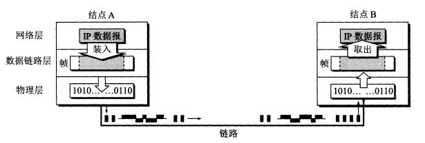
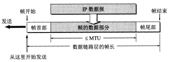
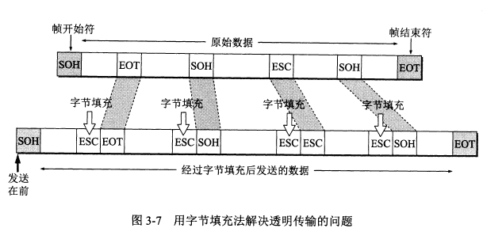
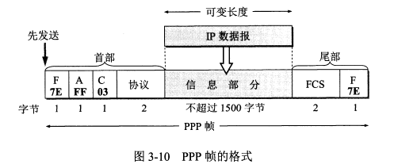
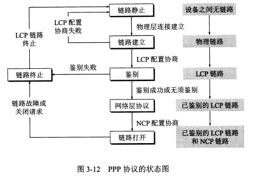
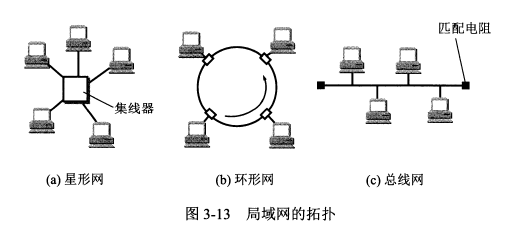
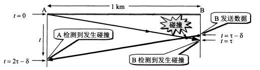
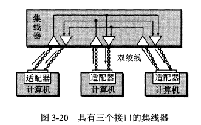
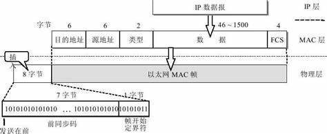

# 第3章 数据链路层

## 使用点对点信道的数据链路层

### 数据链路和帧

> 数据链路

**数据链路** 既包含 **物理线路** 也包含必要的 **通信协议**，将实现协议的软件和硬件加到链路上就构成了数据链路。

常用 **网络适配器**（既包括硬件也包括软件）来实现这些协议，一般适配器包括了数据链路层和物理层两层的功能。

> 帧
>
> **帧** 是点对点信道的数据链路层的 **协议数据单元**。网络层的协议数据单元是IP数据报，又称分组。

数据链路层将网络层交下来的数据构成帧发送到链路上，以及把接收到的帧里的数据取出并上交给网络层。

> 点对点信道的数据链路层在通信时的主要步骤：

1. 结点A的数据链路层把网络层交下来的IP数据报加上首部和尾部封装成帧。
2. 结点A把封装好的帧发送给结点B。
3. 结点B对接收到的帧进行差错检验，若无差错，从帧中提取出IP数据报上交给网络层，若有差错丢弃这个帧。

### 数据链路层的三个基本问题

#### 封装成帧

封装成帧：就是在一段数据前后分别 **添加首部和尾部**，确定帧的界限，然后就构成了一个帧

添加首部和尾部的作用：进行帧定界(确定帧的界限)；包含许多必要的 **控制信息**

**帧长**：帧的数据部分加上帧首部和帧尾部的长度

**最大传送单元** *MTU*：链路层协议规定的所能传送的帧的数据部分长度上限

帧格式如下图：

> **帧定界**
> 
> 方法：可用特殊的帧定界符，在 *ACSCII* 码中，用 *SOH* 表示帧的首部开始，*EOT* 表示帧的结束
>
> 作用：判断收到的帧是否完整，不完整则丢弃

#### 透明传输

**透明传输**：不管什么数据，都能完整无差错的通过这个数据链路层，数据链路层对数据没有妨碍，**数据链路层对数据时透明的**

透明传输中的问题：若数据中的某个字节的二进制代码恰好组成了帧界定符，就会出现错误

解决方法：**字节填充**，在控制字符和特殊字符前插入一个 **转义字符** *"ESC"*，**而真正的首部和尾部前不加**

#### 差错检测

> [!Warning]
> **比特差错**：在传输中可能会产生比特差错，1可能变0，0可能变1
>
> **误码率** *BER*：在一段时间，传输错误的比特占所有传输比特总数的比率，与信噪比有关

> **循环冗余校验** *(CRC)*

**原理**：在发送端，先把数据划分为组，假定每组k个比特，若传输一组数据M=101001(k=6)，在M后添加供差错检测用的n位冗余码后一起发送，共发送(k+n)位，接收方用收到的数据除P，若余数为0则表示没有差错

**冗余码计算方法**：在M后面添加n个0，得到（k+n）位的数除以选定好的除数p，得出商Q，余数R，将余数R作为冗余码，添加到M后

> [!tip]
> **例**：k=6，M=101001，设n=3，除数P=1101，被除数是101001000，计算后得到商Q=110100，余数R=001

**帧校验序列** *(FCS)*：为差错检验而添加的冗余码；就是计算后得到的余数R 

**生成多项式**：一种方便的表示循环冗余校验过程的方法

> [!tip]
> **例**：$P=1101\to P(X)=X^{3}+X^{2}+1$ (最高位对应 $x^{3}$，最低位对应 $x^{0}$)

**传输差错的分类**：
- **比特差错**：1变0，0变1
- **帧丢失**：丢失某个帧
- **帧重复**：某个帧收到多次
- **帧失序**：后发送的帧反而先到达接收端

**CRC的局限性**：只能实现 **无比特差错**，不能实现 **无传输差错**，只能判断收到的数据是否正确，其余均无法判断，并不是可靠传输

> [!tip]
> **无差错接受**：接收端数据链路层接受的帧，都能认为在传输过程中没有产生差错
> 
> **可靠传输**：发送端发送什么，接收端就收到什么

## 点对点协议 PPP

针对点对点的链路，目前使用最广泛的是 *PPP* 协议

### PPP协议特点

作用域：**用户计算机** 和 *ISP* 通信时所使用的数据链路层协议

*PPP* 协议需要满足以下 **需求**：
1. **简单**：对数据链路层的帧，不需要纠错、序号、流量控制，简单作为首要要求；收到帧进行 *CRC* 检验，无差错则接收，反之丢弃
2. **封装成帧**：必须规定特殊的字符作为帧定界符，使接收端从收到的比特流中准确找出帧的开始和结束位置
3. **透明性**：必须保证数据传输的透明性，要能解决碰巧出现和帧定界符一样的比特组合的问题
4. **多种网络层协议**：必须能够在同一条物理链路上同时支持多种网络层协议的运行，如IP等；在局域网和路由器上同样如此
5. **多种类型链路**：必须能够在多种链路上运行
6. **差错检验**：必须能够对接收端收到的帧进行检测，并立即丢弃有差错的帧
7. **检测连接状态**：必须能够自动检测链路是否处于正常工作状态
8. **最大传送单元**：必须对每一种类型的点对点链路设置 *MTU* 的标准默认值；促进各种实现之间的互操作性，若高层协议发送的分组数据部分超过 *MTU* 值，则丢弃并返回差错
9. **网络层地址协商**：必须提供一种机制使通信的两个网络层的实体能够通过协商知道或能够配置彼此的网络层地址
10. **数据压缩协商**：必须提供方法来协商使用数据压缩算法

*TCP/IP* 协议族中，可靠传输由 *TCP* 协议负责。*PPP* 不负责纠错等。*PPP* 只支持点对点的链路通信，且只支持全双工链路。
*PPP* **的特点**：不支持多点线路，只支持点对点的链路通信，只支持全双工链路

*PPP* 协议的 **组成**
- 将 *IP* 数据报封装到串行链路的方法；*PPP* 支持 **异步链路**，也支持面向比特的 **同步链路**；*IP* 数据报在 *PPP* 帧中数据部分，收到 *MTU* 限制
- 用来建立、配置和测试链路连接的链路控制协议 *LCP*
- 网络控制协议 *NCP*，其中每一个协议支持不同的网络层协议

### PPP协议的帧格式

*PPP* 帧格式如下图所示

*PPP* 的首部和尾部分别为 **4个字段** 和 **2个字段**。

- 首部的第一个字段和尾部的第二个字段都是 **标志字段** *F*，规定为 *0x7E*，它标志着一个帧的开始或结束。两个连续的帧之间只需要一个 F，如果连续出现两个标志字段，表示这是一个空帧，应该丢弃。
- 首部的第二个和第三个字段 目前都没有实际含义。第四个字段是 2 字节的协议字段，它表明了信息部分的数据类型（可能是IP数据报也可能是其他类型的数据）。**尾部的第一个字段是帧检验序列** *FCS*。

> [!tip]
> **字节填充**
> 
> *PPP* 使用异步传输时使用了字节填充，转义符为 *0x7D*。
> 
> **零比特填充**
> *PPP* 协议用在 *SONET/SDH* 链路上时使用同步传输，此时采用 **零比特填充方法** 来实现透明传输。
> 
> 零比特填充的方法：当信息字段中出现 5 个连续的 1，立即填入一个 0，这样信息字段中就不会出现 6 个连续的 1（*PPP* 的帧定界符中有 6 个连续的 1）。

### PPP 协议的工作状态

*PPP* **链路从建立到释放的全过程**：用户拨号接入 *ISP* 后，就建立了从用户到 *ISP* 的物理连接。这时用户向 *ISP* 发送一系列的链路控制协议 *LCP* 分组，以便建立 *LCP* 连接。然后网络控制协议 *NCP* 给新接入的用户电脑分配一个临时的 *IP* 地址。等用户通信完毕后，*NCP* 释放网络层连接，收回分配的 *IP* 地址，然后 *LCP* 释放数据链路层连接，最后释放物理层连接。

> *PPP* **链路的状态变化**：

**链路静止**——**链路建立**——**鉴别**——**网络层协议**——**链路打开**——**链路终止**——**链路静止**。

- **链路静止**：*PPP* 链路的其实和终止状态都是链路静止状态。
- **链路建立**：当个人电脑当建立了到路由器的物理层连接后，*PPP* 进入链路建立状态，目的是建立链路层的 *LCP* 连接。
  - 通过 **发送** *LCP* **的配置请求帧**（是一个 *PPP* 帧，协议字段为 *LCP* 对应的代码，信息字段包括特定的配置请求）来协商配置选项，链路的另一端可以回复配置确认帧、配置否认帧或配置拒绝帧。
- **鉴别**：若鉴别身份失败就转到链路终止状态，若成功就进入网络层协议状态
- **网络层协议**：这时 *PPP* 链路的两端的网络控制协议 *NCP* 根据网络层的不同协议互相交换网络层特定的网络控制分组。*PPP* 链路的两端可以运行不同的网络层协议。
- **链路打开**：此时链路的两个 *PPP* 端点可以彼此发送分组。
  - 数据传输结束后链路的一端发送终止请求 LCP 帧请求终止链路连接，收到终止确认后转到链路终止状态。
- **链路终止**。终止后进入链路静止状态。
- **链路静止**

## 使用广播信道的数据链路层

广播信道可以进行 **一对多的通信**，局域网使用的就是广播信道

**局域网** 可以按照拓扑结构进行如下分类

### 局域网的数据链路层

局域网的最主要 **特点**：**网络为一个单位所拥有**，**且地理范围和站点数目都有限**。

局域网的 **优点**：
- 具有广播功能，可以从一个站点很方便地访问全网。局域网上的主机可以共享连接在局域网上的各种硬件和软件资源。
- 便于系统的扩张和逐渐演变
- 提高了系统的可靠性、可用性和生存性。

> 以太网是局域网的一种，绝大多数局域网都是以太网。双绞线是局域网中的主流传输媒体。

实现共享信道的两种方式：
- 静态划分信道：如频分复用、时分复用、码分复用等，但 **不适合局域网**。
- **动态媒体接入控制**，又称 **多点接入**。特点是信道并非在用户通信时固定分配给用户。
  - **随机接入**：特点是用户可以随机地发送消息。如果有两个用户同时发送，在共享媒体上就会产生碰撞，是发送失败。这时就需要解决碰撞的网络协议，即 *CSMA/CD* 协议。
  - **受控接入**：特点是用户不能随机发送信息而必须服从一定的控制。

> 以太网应用的主要是随机接入

#### 适配器

计算机与外界局域网的连接是通过适配器进行的，适配器以前又称网卡。

适配器和局域网之间的通信通过电缆或双绞线以 **串行传输** 方式进行的，而适配器与计算机之间的通信是通过 *I/O* 总线 **并行传输** 的，因此 **适配器的一个重要功能就是进行数据串行传输和并行传输的转换**。

适配器实现的功能包含了数据链路层和物理层两个层次的功能。

适配器收到正确的帧后，使用中断来通知计算机，并把数据交付给协议栈中的网络层。当计算机要发送 *IP* 数据报时，就由协议栈把分组交给适配器，适配器将其组装成帧后发送到局域网。（**封装成帧**、**透明传输**、**差错检错** 等功能都是由 **适配器** 完成的）

计算机的 **硬件地址存储在适配器中**，而 **软件地址-- IP 地址存储在计算机中**

### CSMA/CD协议

局域网中的计算机常被称为 **工作站**、**站点**等

以太网采取以下两种措施简便通信：
1. 采用较为灵活的无连接的工作方式，即不必建立连接就可以直接发送数据。适配器对发送的数据帧不编号，也不要求对方发回确认。它提供的是尽最大努力的交付，是不可靠的交付。对有差错帧是否进行重传由高层来决定。
   - 同一时间只能有一台计算机发送数据，如果发生冲突，就使用 *CSMA/CD* 协议来协调。
2. 以太网发送的数据使用的是 **曼彻斯特编码**

#### CSMA/CD 协议要点

1. **多点接入**：多点接入说明是 **总线型网络**，许多计算机以多点接入的方式连接在一根总线上。**协议的实质就是载波监听和碰撞检测**。
2. **载波监听**：使用电子技术检测信道上有没有其他计算机也在发送。不管是发送前还是发送中，每个站都要不停地检测信道。
3. **碰撞检测**：**边发送边监听**。如果几个站同时发送数据，总线上的信号电压变化会增大，就表明发生了碰撞。这时就立即停止发送。

在使用 *CSMA/CD* 协议时，不能同时发送和接收，因此使用 *CSMA/CD* 协议的以太网只能进行 **半双工通信**（**双向交替通信**）。

**发生碰撞** 是因为传播时延，A 发送了数据但是还没传到 B 处，B 就不知道有人发送了数据。

当 A 和 B 同时发送数据产生碰撞后，他们发送数据都失败，都要推迟一段时间重新发送。

因为不知道是否会发生碰撞，所以以太网存在发送的不确定性。

A 发送数据后最多 $2\theta$ 时间就知道是否碰撞，这 $2\theta$ 时间称为争用期。如果经过争用期还没碰撞，表明发送成功。

如果发生碰撞，以太网使用 **截断二指数退避算法** 来确定碰撞后重传的时机。

以太网规定了争用期的时长，这就约束了以太网的地理范围不能太大，不然传播时延会超过争用期限制。

以太网规定最短帧长为 64 字节（一个争用期可以发送的字节数），如果争用期发生碰撞就会停止发送，因此信道上长度小于 64 字节的帧就是无效帧。

碰撞后除了立即停止发送数据外还要继续发送一个人为干扰信号，通知所有用户现在发生了碰撞。

以太网还规定了 **帧间最小间隔** 96 比特时间，这是为了使刚收到数据帧的栈清理缓存，准备接收下一帧。

#### CSMA/CD 协议要点归纳

1. **准备发送**：适配器从网络层获得一个分组，加上首部和尾部组成以太网帧，放入适配器缓存中。在发送前先检测信道。
2. **检测信道**：若检测到信道忙，则不停地检测直到信道空闲。若检测到空闲，并在 96 比特时间内保持空闲（保证了帧间最小间隔），就发送这个帧。
3. 在发送过程中仍不停地检测，即适配器要 **边发送边监听**。这时有两种情况
   - **发送成功**：争用期内一直未检测到碰撞。发送成功后回到 1。
   - **发送失败**：争用期内检测到碰撞，立即停止发送，并按规定发送人为干扰信号。适配器接着执行 **指数退避算法**，等待足够时间后回到 2。若重传 16 次仍不成功，就停止重传并向上报错。

以太网发送完一帧后要把已发送的帧保留一下。如果争用期检测到碰撞，推迟一段时间后还要重传。

### 使用集线器的星形拓扑

**集线器** 特点：
- 表面上使用集线器的局域网在物理上是一个星形网，但是 **在逻辑上仍是一个总线网**，各站共享逻辑上的总线，还是使用 CSMA/CD 协议。
- 一个集线器有很多接口，像是一个多接口的转发器。
- 集线器工作在物理层，每个接口仅负责转发比特，不进行碰撞检测。

### 以太网的信道利用率

以太网信道的利用率：由于会发生碰撞，实际利用率达不到100%

成功发送一个帧占用信道的时间：$T_0+\tau$

> [!tip]
> 设参数 $a = \tau / T_0$  (**单程端到端时延** $\tau$ 与 **帧的发送时间** $T_0$ 之比)
> 
> $a\to 0$ 表示一发生碰撞就能立即检测出来并停止发送，而 *a* 越大，争用期占比越大，使信道利用率降低
> 
> 因此 *a* 的值越小越好；当数据率一定时，以太网连线的长度受到限制，同时以太网的帧长不能太短

**极限信道利用率** *Smax*：
$$
Smax=\frac{T_0}{T_0+\tau}=\frac{1}{1+a}
$$

**只有参数 *a* 远小于1才能得到尽可能高的极限信道利用率**

### 以太网的 MAC 层

### MAC地址

定义：又叫 **物理地址** 或 **硬件地址**；就是适配器的标识符，用48位二进制数来标识网卡的硬件地址，表示为6个16进制数，在局域网内具 有 **唯一性**

- *I/G* 位：地址字段第一个字节的最低位；为0表示单个站地址、为1表示组地址，用来进行多播
- *G/L* 位：地址字段第一个字节的最低第二位；为0表示全球管理、为1表示本地管理

> 适配器的过滤功能：适配器收到MAC帧后检查帧中目的地址，若发往本站则收下，否则丢弃

局域网中适配器收到的 **帧** 有三种：
- **单播帧**：一对一，即收到的帧的MAC地址与本站的硬件地址相同
- **广播帧**：一对全体，即发送给本局域网上所有站点的帧(全1地址)
- **多播帧**：一对多，即发送给本局域网上一部分站点的帧

以太网适配器有一种特殊的工作方式：**混杂方式**。混杂方式的适配器只要”听到“有帧再传输就悄悄接收下来。

混杂方式可以用来监视和分析以太网上的流量，黑客也常用混杂方式非法获取信息。

#### MAC 帧格式

各字段含义：
- **类型**：用来标志上一层使用的是什么协议
- **数据**：长度在46~1500字节
- **FCS**：帧检验序列，使用 *CRC* 检验

**填充字段**：当数据字段长度小于46字节时，*MAC* 子层会在数据字段后面加入一个整数字节的填充字段，以保证 *MAC* 帧长不小于64字节

**插入的8字节**：
- 从 *MAC* 子层传到物理层时要在帧前插入8字节，由硬件生成
- **前同步码**：7字节；使接收端的适配器在接收 *MAC* 帧时能迅速调整时钟频率，使其和发送端时钟同步
- **帧开始定界符**：定义为10101011；用来表示帧开始

无效的 *MAC* 帧：
- 帧的长度不是整数个字节
- 用收到的帧检验序列 *FCS* 查出差错
- 收到的帧的 *MAC* 客户数据长度不在46~1500字节之间，或 *MAC* 帧长度不在64~1518

## 扩展以太网

物理扩展：集线器、光纤

### 在数据链路层扩展以太网

**网桥**：对收到的帧根据MAC帧目的地址查找地址表进行转发和过滤

**交换机**：工作在数据链路层，实质就是一个多接口网桥
- 特点：交换机上的主机是全双工工作，不会产生冲突，交换机中存有地址表通过自学习算法建立，交换机上所有端口在同一个广播域上

帧转发方式：
- **直通**：收到帧之后直接转发，不必事先把整个数据帧缓存，但也不对帧进行检验
- **存储转发**：将所有帧都收到后进行检查，然后再发送

交换机的自学习功能：

地址表的形成：收到未知的地址后，存储源地址和接口的对应关系，向除来源端口的其它端口广播，目的地址不符则丢弃，否则接收并回复，收到回复后存储对应关系；地址表有有效时间，超过有效时间则失效

生成树协议STP：解决无限循环的问题

### 虚拟局域网

**虚拟局域网**（*VLAN*）：是一些局域网网段构成的与物理位置无关的逻辑组

*VLAN* **标记**：在MAC帧的源地址和类型间插入4字节的 *VLAN* 标记，交换机收到帧后只向所属 *VLAN* 转发，而不进行广播

最大帧长变为1522字节(1518+4)
