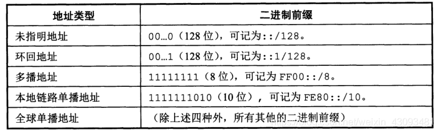

# 第4章 网络层

## 网络层提供的两种服务

> **网络层** 提供服务的特点：网络层向上只提供简单的、**无连接的**、尽最大努力交付的数据报服务，不保证可靠通信

### 虚电路服务

**虚电路服务**：保证可靠通信，**必须建立连接**

- **思路**：可靠通信由网络保证
- **连接的建立**：必须有
- **终点地址**：仅在连接建立阶段使用，每个分组使用短虚电路号
- **分组转发**：属于同一条虚电路的分组均按照统一路由进行转发
- **当节点出故障**：所有通过故障的结点的虚电路均不能工作
- **分组的顺序**：总是按发送顺序到达终点
- **端到端的差错处理**：可以由网络负责，也可以由用户主机负责

### 数据报服务

**数据包服务**：尽最大努力发送，不保证可靠通信

- **思路**：可靠通信由用户主机保证
- **连接的建立**：不需要
- **终点地址**：每个分组都有终点的完整地址
- **分组转发**：每个分组独立选择路由器进行转发
- **当结点出故障**：出故障结点可能会丢失分组，一些路由可能会发生变化
- **分组的顺序**：到达终点的时间不一定按发送顺序
- **端到端的差错控制**：由用户主机负责

## 网际协议 IP

这里的 *IP* 实际是 *IPv4*

与 *IP* 配套使用的三种协议：
- **地址解析协议** *ARP*
- **网际控制报文协议** *ICMP*
- **网际组管理协议** *IGMP*


### 虚拟互连网络

> **虚拟互连网络**：**逻辑互连** 的网络可以由多种异构网络互连组成，在网络层上看起来像一个统一的网络

**中间设备**：用于网络互相连接：
- **物理层** 的中间设备：**转发器**
- **数据链路层** 的中间设备：**网桥**
- **网络层** 的中间设备：**路由器**
- **网络层以上** 的中间设备：**网关**

### 分类的 IP 地址

*IP* 地址的 **编址方法**：
- **分类的** *IP* **地址**：是最基本的编址方法
- **子网的划分**：对最基本编址方法的改进
- **构成超网**：比较新的无分类编址方法

#### 分类的 IP 地址

将 *IP* 地址划分为若干个固定类，每一类地址都由 **网络号** *(net-id)* 和 **主机号** *(host-id)* 构成

一个 *IP* 地址再整个互联网范围内是 **唯一的**


如上图所示，分类的 *IP* 地址分为以下五类;
- **A** 类、**B** 类、**C** 类都是 **单播地址**，是最常用的。
- **D** 类是用于 **多播**（一对多通信）。
- **E** 类地址保留为以后用。

> *IP* 地址的记法：**点分十进制记法**
> 
> *IP* 地址是 **4** 字节共 **32** 位字符，平常电脑上显示的是每个字节按转化为 10 进制后的结果，称为 **点分十进制法**。


#### 常用的三类 IP 地址

- **A类**
  - 最大可指派网络数：126(2^7-2)    8位除去1个固定位剩7位，减2因为要除去全0和全1位
  - 第一个可指派的网络号：1
  - 最后一个可指派的网络号：126
  - 每个网络中最大主机数：16777214(2^24-2（网络地址+广播地址）)
- **B类**
  -  最大可指派网络数：16383(2^14-1)    16位除去2个固定位，减1因为有两个固定位为10，所以不存在全0或全1，但规定128.0.0.0不使用，所以减去
  -  第一个可指派的网络号：128.1
  -  最后一个可指派的网络号：191.255
  -  每个网络中最大主机数：65534(2^16-2(网络地址+广播地址))
- **C类**
  - 最大可指派网络数：2097151(2^21-1)    24位除去3个固定位，减1同B类，192.0.0.0规定不使用
  - 第一个可指派的网络号：192.0.1
  - 最后一个可指派的网络号：223.255.255
  - 每个网络中最大主机数：254(2^8-2(网络地址+广播地址))

*IP* 地址的指派范围


> [!ATTENTIOn]
> 下表是一些一般不使用的特殊 *IP* 地址

| 网络号 |       主机号       | 源地址使用 | 目的地址使用 | 含义                                                      |
| :----: | :----------------: | :--------: | :----------: | :-------------------------------------------------------- |
|   0    |         0          |    可以    |     不可     | 在本网络上的主机（见《计算机网络》(谢希仁)6.6节DHCP协议） |
|   0    |      host-id       |    可以    |     不可     | 在本网络上的某个主机host-id                               |
|  全1   |        全1         |    不可    |     可以     | 只在本网络上进行广播（各路由器均不转发）                  |
| net-id |        全1         |    不可    |     可以     | 对net-id上的所有主机进行广播                              |
|  127   | 非全0或全1的任何数 |    可以    |     可以     | 用作本地软件回环测试之用（例如**127.0.0.1**）             |

*IP* 地址的重要 **特点**：
- 每一个 *IP* 地址都由网络号和主机号两部分组成，是一种分等级的地址结构
- 实际上 *IP* 地址是标志一个主机或(路由器)和一条链路的接口
- 用转发器或网桥连接起来的若干给局域网仍为一个网络，因为这些局域网都具有同样的网络号 *net-id*
- 所有分配到网络号的网络都是 **平等的**

网络上的 *IP* 地址
- 同一局域网上的各IP地址的网络号都是相同的
- 用网桥互连的网段仍是一个局域网，只有一个网络号
- 一个路由器有多个接口，每个接口对应的网络号不同
- 两路由器直接相连时，可以不给两端接口分配IP，这样的特殊网络也叫无编号网络或无名网络

### IP 地址与硬件地址

**硬件地址**（又称 **物理地址**、*MAC* **地址**）是数据链路层和物理层使用的地址。*MAC* 帧传送时使用的源地址和目的地址都属于硬件地址，放在 *MAC* 帧的首部。

*IP* 地址是网络层和以上各层使用的地址，是一种 **逻辑地址**。放在 *IP* 数据报的首部。


### 地址解析协议 ARP

*IP* 地址与 *MAC* 地址：源 *IP* 地址和目的 *IP* 地址始终不变；而源 *MAC* 地址和目的 *MAC* 地址在每条链路上都要变化            

**作用**：从网络层使用的 *IP* 地址，解析出在数据链路层使用的硬件地址

**工作方式**：每个主机里都设有一个 *ARP* 高速缓存，里面有所在局域网上各主机和路由器的 *IP* 地址到硬件地址的映射表，且这个映射表经常动态更新

**工作流程**：当主机A向局域网上某个主机B发送IP数据报时，先在ARP高速缓存中查看有无主机B的IP地址，若有，就可查出对应的硬件地址，反之，执行 *ARP* 请求分组：
1. *ARP* 请求分组：在局域网广播一个 *ARP* 请求分组，包含发送方硬件地址，发送方 *IP* 地址，目的方硬件地址(未知时填0)，目的方 *IP* 地址
2. 本地广播 *ARP* 请求，路由器不转发 *ARP* 请求
3. *ARP* 响应分组：某主机收到广播，发现本机 *IP* 与查询 *IP* 一致，就回复 *ARP* 响应分组，包含发送方硬件地址，发送方 *IP* 地址；同时将请求分组中 *IP* 与硬件地址对应关系保存
4. 收到回复的 *ARP* 响应分组后，将对应 *IP* 和硬件地址存入 *ARP* 高速缓存中，方便下次使用

**生存时间**：*ARP* 高速缓存中每条映射都只存在一段时间，超过时间后就被删除

**特点**：
- *ARP* 协议只解决 **同一局域网上** *IP* 地址和硬件地址映射问题，不在同一局域网则无法解决 
- *ARP* 工作过程对于用户来说完全透明

四种使用 *ARP* 的典型情况：
- 发送方是主机，要把 *IP* 数据报发送到本网络上的一个主机，这时 *ARP* 找到目的主机的硬件地址
- 发送方是主机，要把 *IP* 数据报发送到另一个网络上的一个主机，这时 *ARP* 找到本网络上的一个路由器的硬件地址，剩下的工作由这个路由器完成
- 发送方是路由器，要把 *IP* 数据报发送到本网络上的一个主机，这时 *ARP* 找到目的主机的硬件地址
- 发送方是路由器，要把 *IP* 数据报发送到另一个网络上的主机，这时 *ARP* 找到本网络上的一个路由器的硬件地址，剩下的工作由这个路由器完成

### IP 数据报格式


**首部** 各字段含义；
- **版本**：占4位，说明该IP数据报使用的 *IP* 协议的版本，通信双方必须使用同一个 *IP* 协议版本
- **首部长度**：占4位，长度20~60字节，因为 *IPv4* 中首部存在可变部分，所以需要指出首部的长度以划分首部与数据部分；以4字节为单位，不是4的整倍数时要填充至整倍数
- **区分服务**：占8位，只在区分服务时才起作用，一般不用
- **总长度**：占16位，说明该 *IP* 数据报的总长度(首部+数据)。*IP* 数据报封装为 *MAC* 帧时受限于 *MAC* 帧的长度上限，所以 *IP* 数据报还存在“分片”操作，即将 *IP* 数据报分为多片，封装进多个 *MAC* 帧。因此 *IP* 数据报最大长度2^16-1=65535字节
- **标识**：占16位，*IP* 数据报若存在分片，则接收方需要将各分片组合出原 *IP* 数据报，相同标识号的 *IP* 数据报就说明它们其实是同一个源 *IP* 数据报。
- **标志**：占3位，目前只有前两位有意义，最低位为 *MF（More Fragment）*，若MF=1则说明该数据报后面“还有分片”。中间一位为 *DF（Don't Fragment）*，若DF=1则不能分片，只有DF=0才可以分片
- **片偏移**：占13位，用于说明该 *IP* 数据报（已分片）在源 *IP* 数据报中的相对位置（相对于数据字段的起点），单位是8字节，每个分片一定是8字节的整倍数
- **生存时间**：*IP* 分组在网络中传递时有可能出现“兜圈子”的情况，所以需要对 *IP* 数据报进行一定的限制，生存时间的单位是“跳数”，最大值为255，每经过一个路由器，路由器便将 *IP* 数据报的生存时间-1，当 *IP* 数据报中的生存时间为0时，路由器丢弃该分组。
- **协议**：说明该 *IP* 数据报的上层协议类型，如 *IP* 对应4，*TCP* 对应6，*UDP* 对应17
- **首部校验和**：验证首部是否存在传输错误，只检验首部，不包括数据部分
- **源地址**
- **目的地址**

**可变部分**：长度为1~40字节，*IP* 地址中的可变部分可用于支持很多操作，但很多情况都用不上，而且会增加路由器处理分组的开销，所以 *IPv6* 中的数据报首部做成了固定长度

### IP 层转发分组的流程

路由器的路由表中不直接存储主机地址，而是 **存储目的网络的地址和对应下一跳的地址**。

路由表中并没有指明完整的网络路径，仅指出要想到达某个网络，需要先到哪个路由器，即仅指出下一步该怎么走。这样一跳一跳直到最后到达目的网络。


分组转发算法：
1. 从数据报的首部提取出目的主机的 IP 地址 D，得出目的网络地址为 N。
2. 若 N 就是与此路由器直接相连的某个网络地址，就直接交付，即直接把数据报交付目的主机；否则就是间接交付，执行 3。
3. 若路由表中有目的地址为 D 的特定主机路由，则把数据报传送给路由表中所指明的下一跳路由器。否则执行 4。
4. 若路由表中有到达网络 N 的路由，则把数据报传送给路由表所指明的下一跳路由器，否则执行 5。
5. 若路由表有一个默认路由，则把数据报传送给路由表所指明的默认路由器，否则执行 6。
6. 报告转发分组出错。


## 划分子网和构造超网

### 划分子网

两级 *IP* 地址的问题：
- *IP* 地址空间利用率有时很低
- 给每个屋里网络分配一个网络号会使路由表变得很大，因此是网络性能变坏
- 两级 *IP* 地址不够灵活

划分子网的 **基本思路**：借用主机号若干位作为子网地址

划分子网后的IP地址：| **网络号** | (**子网**) | **主机号** |

#### 子网掩码

**作用**：用来找出 *IP* 地址中的子网部分，长度为32位，原 *IP* 中网络号和子网部分置为1，主机号部分置为0

(*IP* 地址)and(子网掩码)=网络地址

默认子网掩码：在不进行子网划分时，也要给出子网掩码，就用默认子网掩码


子网掩码是一个网络或一个子网的重要属性，路由表中的每一项还要给出该网络的子网掩码

子网数：2^k-2，k表示子网号的位数，减去全0和全1，就是可用子网数，虽然现在全0和全1地址也可以使用，但不推荐

子网 **划分方法**：
- **固定长度划分**：所划分的所有子网的子网掩码都是相同的，取所用最大的主机数进行划分
- **变长划分**：根据需求灵活划分

### 使用子网时的分组转发

子网划分后的路由表：包含 **目的网络地址**、**子网掩码**、**下一跳地址**

子网划分后的路由器转发分组算法：
1. 从收到的数据报首部提取目的 *IP* 地址D
2. 先判断是否为直接交付。对路由器直接相连的网络进行逐个检查：用各网络的子网掩码和D逐位相与，看结果是否和相对应的网络地址匹配。若匹配，则把分组进行直接交付，转发任务结束。否则就是间接交付，执行（3）。
3. 路由表中有目的地址为D的特定主机路由，则把数据报传送给路由表中所指明的下一跳路由：否则执行（4）。
4. 对路由表的每一行，用其中的子网掩码和D逐位相与，其结果为N。若N与该行的目的网络地址匹配，则把数据报传送给该行指明的下一跳路由器；否则执行（5）。
5. 若路由表中有一个默认路由，则把数据报传送给路由表中所指明的默认路由器；否则执行（6）。
6. 报告转发分组出错

### 无分类编址 CIDR （构造超网）

**无分类编址** 全名 无分类域间路由选择 *CIDR*。

*CIDR* 有两个主要特点
- *CIDR* 消除了传统的 A,B,C 类地址和划分子网的概念，它把 32 位的 *IP* 地址分为前后两部分。“前缀”用来指明网络，后面部分用来指明主机。因此它使用的是两级编址，但是是 **无分类的两级编址**。
- *CIDR* 把前缀都相同的连续的 *IP* 地址组成一个 *CIDR* 地址块，只要知道该地址块中的任意一个地址，就可以知道地址块的起始地址、最大地址和地址块中的地址数。

*CIDR* 使用 32 位的地址掩码，地址掩码中 1 的个数对应的就是前缀的长度。前缀越短，其地址块包含的地址数越多。

**最长前缀匹配**：*CIDR* 中，路由表的每个项目由网络前缀和下一跳地址组成，查找时可能得到不止一个匹配结果。这是从匹配结果中选择具有最长网络前缀的路由，因为它对应的地址块最小。

使用 **二叉线索树** 查找路由表：无分类编址的路由表通常存放在一个 **二叉线索树** 中。 

下图的二叉线索树表示了一个有 5 个 *IP* 地址的路由表。树的每一层对应 *IP* 地址中的一位，树最多有 32 层。
给定一个 *IP* 地址，查找它是否在该项目表中，只需在二叉线索树中一层层对应向下寻找，若中间无法在二叉树中找到对应分支，表明这个地址不在这个二叉线索中。


## 网际控制报文协议 ICMP

**作用**：*ICMP* 允许主机或路由器报告差错和提供有关异常情况的报告

**报文格式** 如下图


### ICMP 报文种类

*ICMP* 报文包括 *ICMP* **差错报告报文** 和 *ICMP* **询问报文** 两类，每类下细分为几种不同的类型。


表中给出了 4 种常用的 *ICMP* **差错报告报文**：
- **终点不可达**：当路由器或主机不能交付数据报时就向源点发送此报文。
- **时间超过**：路由器收到生存时间为 0 的报文时，除丢弃该数据报外，还要向源点发送此报文。当终点在约定时间内未收到一个数据报的全部分片时，就丢弃已收到的所有分片，并向源点发送此报文。
- **参数问题**：当路由器或目的主机收到的数据报的首部中有的字段值不正确时，就丢弃该数据报并发送此报文
- **改变路由**（重定向）：路由器把此报文发送给主机，以告诉主机下次将数据报发给另外的路由器。

另外 2 种常用的 *ICMP* **询问报文**：
- **回送请求报文和回答报文**：回送请求报文是由主机或路由器向一个特定目的主机发出的询问。收到此报文的主机必须给源主机发送 *ICMP* 回送回答报文。
- **时间戳请求报文和回答报文**：时间戳请求报文是请某台主机或路由器回答当前的日期和时间。通过它可以进行时钟同步和时间测量。

> *ICMP* 差错报告报文的数据字段是 **固定格式的**：把收到的需要进行差错报告的 *IP* 数据报的首部和数据字段的前 8 个字节（为了得到运输层的端口号和运输层报文的发送序号）提取出来作为 *ICMP* 报文的数据部分。


### ICMP 的应用举例

#### PING

*ICMP* 的一个重要应用是进行分组网间探测 *PING（Packet InterNet Groper）*，以测试两台主机之间的连通性。

*PING* 使用了 *ICMP* 回送请求和回送回答报文。它会连续发送 4 条回送请求报文。

*PING* 是应用层直接使用 *ICMP* 的例子，**未经过运输层**。

使用方法：在 *Windows* 的 *Dos* 窗口中键入 *ping hostname* 即可测试本机与主机 *hostname* 之间的连通性，*hostname* 应该是某个主机的 *IP* 地址或域名

```bash
ping www.baidu.com;//测试与百度之间的连通性
ping 192.168.100.5;//测试与 IP 地址为 192.168.100.5 的之间的连通性
```

#### tracert

*tracert* 可以用来跟踪一个分组从源点到终点的路径。

*tracert* 从源主机向目的主机发送一连串的 *IP* 数据报。数据报中封装的是无法交付的 *UDP* 用户数据报。

这些数据报中，第一个数据报的生存时间 *TTL* 设为 1，后面依次增长。当第 i 个数据报到达了路径上的第 i 个路由器，其 *TTL* 也减到了 0，此时该路由器就会发送 *ICMP* 时间超过差错报告报文给源主机。由此就可以获得到达目的主机所经过的所有路由器的 *IP* 地址，以及到达每一个路由器的往返时间。

使用方法：在 *Windows* 的 *Dos* 窗口中键入 *tracert* *hostname* 即可测试本机到主机 *hostname* 所经过的路由器。


## 互联网的路由选择协议

### 路由选择协议基本概念

**分层次的路由选择协议**：互联网采用分层次的路由选择协议，自适应的(动态的)、分布式路由选择协议

**自治系统** *AS*：在单一技术管理下的一组路由器，在 *AS* 内部使用内部网关协议，*AS* 之间使用外部网关协议

路由器选择协议分类：
- **内部网光协议** *IGP*：在一个自治系统内部使用。如 *RIP*、*OSPF* 协议
- **外部网光协议** *EGP*：在不同自治系统之间使用。如 *BGP* 协议

### 内部网关协议 RIP

概述：是一种 **分布式**，**基于距离** 的路由选择协议

> **距离**：直连网络距离为1，每过一个非直连网络距离加1，距离也称为跳数，每经过一个路由器跳数就加1，距离实际上指最短距离

*RIP* 允许一个路径最多包含15个路由器，也就是距离最大值为16，故 *RIP* 适合 **小型互联网** 使用；*RIP* 不能在两个网络之间同时使用多条路由

工作流程：
- 每个路由器每隔一段时间向外广播，每个路由器收到广播后更新自己的路由表
- 刚开始时只知道直连网络的距离，路由表为空，以后，每个路由器只和数目有限的相邻路由器交互并更新路由信息，经过若干次更新后，所有路由器最终会知道到达本自治系统其他路由器的最短距离和下一跳地址，此时称该网络收敛

*RIP* 协议的特点：
- 仅和相邻路由器交换信息，不相邻的路由器不交换信息
- 交换的信息是当前本路由器所知道的全部信息，即其现在的路由表
- 按固定时间间隔交换信息

**距离向量算法**：
1. 路由器收到地址为X的相邻路由器的一个 *RIP* 报文，修改报文中所有项目，把下一跳地址改为X，把距离字段值都+1
2. 对修改后的 *RIP* 报文中的每个项目重复以下步骤
   - 若项目中目的地址不在路由表中，则加入路由表；
   - 若下一跳给出的路由器地址与RIP报文传来地址相同，则用收到的项目替换原路由表中的项目
   - 若收到项目中的距离小于路由表中的距离，进行更新
3. 若超过3分钟未收到相邻路由信息，则将其标记为不可达，即把距离置为16
4. 返回

> [!tip]
> **例**：路由表更新
> 
> 
> 
> **解**：先将收到的路由表进行修改：
> 
> 
> 
> 将修改后的表与路由表对比：
> - net1：原路由表中没有，故加入
> - net2：原表中有，且下一跳相同，替换原有
> - net3：原表中有，但下一跳不同，比较距离，选择较小的


### 内部网关协议 OSPF

主要特征：使用分布式的链路状态协议，而不像 *RIP* 使用距离向量协议

要点：
- 向本自治系统中所有路由器发送信息。使用洪泛法，向所有相邻路由发送信息，每个相邻路由又再将此信息发给所有相邻路由
- 发送信息就是与本路由器相邻的所有路由器的链路状态，说明与哪些路由相邻，以及该链路的"度量"；而不是发生路由表
- 只有当链路状态发生变化时，才使用洪泛法发生信息；不是定期更新

> **度量**：费用，距离，时延，带宽

**链路状态数据库**：实际就是全网的拓扑结构图，它在全网范围内是一致的，能较快的更新，收敛较快

*OSPF* 的 **区域**：为使 *OSPF* 能够用于规模很大的网络，*OSPF* 将一个自治系统再划分为若干各更小的范围，叫做区域；必须要有一个主干区域，其它区域一般都和主干区域直接相连；每个区域都有一个32位的区域标识符；区域不能太大，一个区域路由器数量不超过200个；

**优点**：使用泛洪法交换链路信息时，仅在一个区域内而不是整个自治系统中，这减小了整个网络上的通信量

**特点**：
- 使用层次结构的区域划分
- *OSPF* 直接用 *IP* 数据报传送，而不用 *UDP*
- 支持可变长度的子网划分和无分类编址 *CIDR*
- *OSPF* 对于不同类型的业务可计算出不同的路由
- 到达同一目的网络可有多条代价相同的路径，多路径间的负载平衡
- 所有在 *OSPF* 路由器之间交换的分组都具有鉴别功能

### 外部网关协议 EGP

*BGP* 是 *BGP*-4 的简写。*BGP* 是不同 *AS* 的路由器之间交换路由信息的协议，是一种路径向量路由选择协议。*BGP* 力求寻找一条能够到达目的网络（**可达**）且比较好的路由（**不兜圈子**），而非寻找最佳路由。

### 路由器的构成

**路由器**：路由器是一种由多个输入端口和多个输出端口的 **专用计算机**

两大部分：
- **路由选择部分**：路由选择处理机，路由选择协议，路由表
- **分组转发部分**：交换结构，一组输入端口，一组输出端口

- 转发与路由选择：转发根据转发表，转发表由路由表而来，路由选择根据路由表，路由表由路由选择协议及相关算法而来
- 分组丢弃：由于没有足够存储空间
- 交换结构：交换结构是路由器的关键部件、把分组从一个输入端口转到一个输出接口
- 三种交换方式：通过存储器、通过总线、通过互连网络


## IPv6

*IPv4* 的地址已经耗尽。

*IPv6目前尚未推出标准协议*

### IPv6 基本首部

主要变化：
- 更大的地址空间：将地址从32位增大到128位
- 扩展的地址层次结构
- 灵活的首部格式：定义了很多可选的扩展首部
- 改进的选项：允许数据报包含有选项的控制信息，其选项放在有效载荷中
- 允许协议继续扩充
- 支持即插即用：自动配置，不需要使用DHCP
- 支持资源的预分配
- 首部改为8字节对齐

*IPv6* 数据报分为基本首部和有效载荷。有效载荷中允许有 0 个或多个扩展首部。注意扩展首部不属于首部。

#### 基本首部


首部长度固定位40字节

各字段含义：
- **版本**：占4位。指明协议的版本
- **通信量类**：占8位。为了区分不同的 *IPv6* 数据报的类别或优先级
- **流标号**：占20位。标明数据报所属的流，在流经过的路径上的路由器都保证服务质量
- **有效载荷长度**：占16位。指明除基本首部外的字节数，最大值是64KB
- **下一个首部**：占8位。相当于 *IPv4* 的协议字段或可选字段。当没有扩展首部时，指明首部后面的数据应交付IP上层哪个协议；有扩展首部时，就标识后面第一个扩展首部的类型
- 跳数限制：占8位。防止数据报在网络中无限期存在，最大255跳，每转发一次就-1，为0就将这个数据报丢弃
- **源地址**：占128位。是数据报发送端的IP地址
- **目的地址**：占128位。是数据报接收端的IP地址

### IPv6 地址

**结点与接口**：将实现 *IPv6* 的主机和路由器均称为结点

*IPv6* 的表示：
- **冒号16进制记法**：用8段，每段4个16进制数组成，允许将数据前的0省略
  - **例**：68E6:8C64:FFFF:FFFF:0:1180:FFFF:FFFF
- **零压缩**：一串连续的零可用一对冒号所代替，在一个地址中只能使用一次，若多次压缩将导致地址无法还原
  - **例**：FF05:0:0:0:0:0:0:0:03 => FF05::03
- **点分十进制记法的后缀**：可将 *IPv4* 地址前添加6组0，使其变成 *IPv6* 的地址
  - **例**：0:0:0:0:0:0:128.10.2.1  = ::128.10.2.1

*IPv6* 地址分类



### IPv4 向 IPv6 过渡

两种从 *IPv4* 向 *IPv6* 过渡的策略：**双协议栈** 和 **隧道技术**。

#### 双协议栈

双协议栈即使一部分主机或路由器装有双协议栈：一个 *IPv4* 和一个 *IPv6*，当它与 *IPv6* 主机通信时使用 *IPv6* 地址，与 *IPv4* 主机通信时使用 *IPv4* 地址。

双协议栈 **使用域名系统** *DNS* **来查询目的主机使用哪一种地址**。

#### 隧道技术

当源主机和目的主机都采用 *IPv6* 时，中间经过的网络有可能是 *IPv4* 网络。

在 *IPv6* 数据报要进入 *IPv4* 网络时，把 *IPv6* 数据报作为数据部分封装到 *IPv4* 数据报中，等离开 *IPv4* 网络后在把数据部分取出来。


### ICMPv6

*ICMPv6*：地址解析协议 *ARP* 和 *IGMP* 都集合到 *ICMPv6* 中
分类：差错报文，信息报文，邻站发现报文，组成员关系报文

*ICMPv6* 是面向报文的协议，利用报文来报告差错、获取信息。


## IP 多播

### IP 多播基本概念

在一对多的通信中，多播可以比单播节省很多资源。

**局域网具有硬件多播功能**，所以不需要复制分组就能使所有的多播组成员收到分组。

*IP* 多播所传送的分组需要使用多播 *IP* 地址。在传统的 *IP* 地址中的 D 类地址就是多播地址，每个 D 类地址可以标识一个多播组。

多台主机可以 **加入到一个多播组中共享一个多播地址**。不同网络的主机可以加入到同一个多播组中。**每一台主机可以随时加入或离开一个多播组**。

能够运行多播协议的路由器为 **多播路由器**。

多播地址只能用于 **目的地址**，**不能用于源地址**。

*IP* 多播有两种：
- 在本局域网上硬件多播
- 在互联网范围内进行多播

### 在局域网上进行硬件多播

多播 *IP* 地址与以太网硬件地址之间有映射关系，但不是一一对应的。收到多播数据报的主机需要在 *IP* 层进行过滤。

### 网际组管理协议 IGMP 和多播路由器选择协议

#### IGMP

*IGMP* 协议用于让连接在本地局域网上的多播路由器知道本局域网上是否有主机参加或退出了某个多播组。*IGMP* 工作在单个本地局域网内部。

因为主机随时可能加入或退出某个多播组。并且发送多播数据报的主机可以位于多播组内，也可以不位于多播组内。所以 *IP* 多播很复杂。

*IGMP* 协议工作内容：
- 当某台主机加入某个多播组时，该主机向多播组的多播地址发送一个 IGMP 报文，声明自己成为了该组的成员。本地的多播路由器收到 IGMP 报文后还要转发给其他多播路由器。
- 组成员关系是动态的。本地多播路由器要周期性地探询本地局域网上的主机是否还是组的成员。

#### 多播路由选择协议

多播路由选择协议有多种，尚未进行标准化。

多播路由选择协议在转发多播数据报时有以下三种方法：
- 洪泛与剪除。
- 隧道技术
- 基于核心的发现技术

目前的多播路由选择协议：
- 距离向量多播路由选择协议 *DVMRP*
- 基于核心的转发树 *CBT*
- 开放最短通路优先的多播扩展 *MOSPF*
- 协议无关多播-稀疏方式 *PIM-SM*
- 协议无关多播-密集方式 *PIM-DM*

## 虚拟专用网 VPN 和网络地址转换 NAT

### 虚拟专用网 VPN

**概述**：用于机构内部的通信，而不是用于和网络外非本机构的主机通信，但没有真正使用通信专线，*VPN* 只是在效果上和真正的专用网一样

*VPN* 的构建：所有通过互联网传送的数据都必须加密，要构建VPN必须为它的每一个场所配置专门的硬件和软件，使每一个场所的 *VPN* 系统都知道其他场所的地址

远程接入 *VPN*：可以满足外部流动员工访问公司网络的需求

### 网络地址转换 NAT

要在路由器上安装 *NAT* 软件，装有 *NAT* 软件的路由器称为 *NAT* **路由器**，它至少有一个有效的外部全球 *IP* 地址，所有使用本地地址的主机在和外界通信时，都要在 *NAT* 路由器上将其本地地址转换为全球 *IP* 地址，才能和互联网连接

网络转换 **过程**：
- 在内部主机与外部主机通信时，在 *NAT* 路由器上进行了两次转换
- 离开专用网时：替换源地址，将内部地址替换为全球地址
- 进入专用网时：替换目的地址，将全球地址替换为内部地址

通过 *NAT* 路由器的通信必须由专用网内的主机发起，专用网内部的主机不能充当服务器用，因为互联网上的用户无法请求专用网内的服务器提供服务

#### 网络地址与端口号转换 NAPT

可以使多个本地主机共用一个全球 *IP* 地址

*NAPT* 地址转换过程：*NAPT* 把专用网内不同的源 *IP* 地址，都转换为同样的全球 *IP* 地址，但对源主机所采用的 *TCP* 端口号，则转换为不同的新的端口号，因此，当 *NAPT* 路由器收到从互联网发来的应答时，就可以从 *IP* 数据报的数据部分找出运输层的端口号，然后根据不同的目的端口号，从 *NAPT* 转换表中找到正确的目的主机

## 多协议标记交换 MPLS

多协议标识MPLS的上层可以采用多种协议，可以使用多种数据链路层协议

为实现交换，可以利用面向连接的概念，使每一个分组携带一个叫做标记的小整数

