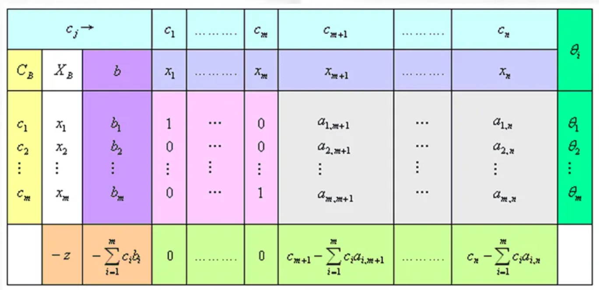

# 单纯形法
## 线性规划一般形式
在约束条件下、寻找目标函数 *z* 的最大值
$$
max(or \ min) \ z = \displaystyle\sum_{j=1}^n c_jx_j \\
s.t. 
\begin{cases}
   \displaystyle\sum_{j=1}^n a_{ij}\ \leq\ (or\ =,\geq)\ b_i\quad(i\ = 1,...,m) \\
   \\
   x_j\ \geq \ 0 \qquad \qquad \qquad \quad \ \ \  (j\ = 1,...,n)
\end{cases}
$$

---

## 线性规划的标准形式
标准形需要满足的条件：
1. 目标函数求**最大值** *max*
2. 约束条件均为**等式**
3. 所有决策变量均为**非负约束**
4. 约束条件右端常数项 $b_i$ 全为非负值 

一般来说，规定线性规划的标准形式为：
$$
max\ z = \displaystyle\sum_{j=1}^n c_jx_j \\
s.t. 
\begin{cases}
   \displaystyle\sum_{j=1}^n a_{ij}\ =\ b_i\qquad \qquad(i\ = 1,...,m) \\
   \\
   x_j\ \geq \ 0\ ,\ b_i\ \geq \ 0 \qquad (j\ = 1,...,n)
\end{cases}
$$
可以写成矩阵形式：
$$
max\ z\ = CX \\
AX\ =\ b \\
X\ \geq \ 0 \\ 
A\ =\ 
\begin{pmatrix}  
a_{11} & a_{12} & \cdots & a_{1n} \\
\vdots & \vdots & \ddots & \vdots \\
a_{m1} & a_{m2} & \cdots & a_{mn}
\end{pmatrix}
$$

将一般线性规划问题化为标准型：
1. 目标函数极大化。（可通过取相反数实现）
2. 将不等式约束条件通过添加松弛变量得到方法华为等式
   - 约束条件为 $\leq$ 不等式，则在约束条件的左端加上一个非负的松弛变量；
   - 约束条件为 $\geq$ 不等式，则在约束条件的左端减去一个非负的松弛变量。
3. 取值无约束的变量：
   - 若存在**无约束的变量**$x_k$，可令 $x_k\ = x_k^{'}\ -\ x_k^{''}$，其中 $x_k^{'}，x_k^{''}\  \ge \ 0$。

---

## 单纯形法求解
几个基本定理：
- 若线性规划问题存在可行解，则问题的可行域是凸集
  - 引理：线性规划问题的可行解 $X\ =\ (x_1,\cdots,x_n)^{T}$ 为基可行解的充要条件是 $X$ 的正分量所对应的系数列向量是线性无关的。
- 线性规划问题的基可行解 $X$ 对应线性规划问题可行域（凸集）的顶点
- 若线性规划问题有最优解一定存在一个基可行解是最优解

单纯形法求解过程：
1. 化为标准型（要求 $b \ge 0$）,确定初始基*B*，建立**初始单纯行表**(假设*A*矩阵中存在**单位矩阵**)

2. 其中:
$$
\theta\ =\ \min{(\frac{b_i}{a_{ik}}\ |\ a_{ik}\ >\ 0)}
$$
2. 若 $\sigma_j\ \le 0\ (j\ =\ m+1,\cdots,n)$，则已得到最优解，否则转入下一步
3. 若在 $j\ =\ m+1,\cdots,n$ 中，存在 $\sigma_k\ >\ 0$, 而 $P_k\ <\ 0$，则无最优解。
4. 确定换入变量和换出变量
   - 由 $\max(\sigma_k>0)\ =\ \sigma_k$，确定 $x_k$ 为换入变量
   - 由 $$\theta\ =\ \min{(\frac{b_i}{a_{ik}}\ |\ a_{ik}\ >\ 0)}\ = \frac{b_l}{a_{lk}}$$ 确定 $x_l$ 为换出变量。
5. 以 $a_{lk}$ 为主元进行迭代
   即将
   $$P_k=
   \begin{pmatrix}
      a_{1k} \\
      \vdots \\
      a_{lk} \\
      \vdots \\
      a_{mk}
   \end{pmatrix}
   迭代成
   \begin{pmatrix}
      0 \\
      \vdots \\
      0 \\
      1 \\
      0 \\
      \vdots \\
      0
   \end{pmatrix}
   \to l行
   $$
6. 重复 2~5 步骤

### 单纯形法进一步讨论
- 人工变量法（大M法）
  - 凑单位矩阵添加人工变量
  - 目标函数中人工变量的系数为足够大的一个负值，用“$-M$”表示
- 两阶段法
  - 第一阶段实现求解一个目标函数中只包含人工变量的线性规划问题（令目标函数中其他变量的系数取零），人工变量的系数取某个**正的常数**（一般取1），在保持**原问题约束条件不变**的情况下求这个目标函数的**极小值**
    - 当人工变量取值为0时，目标函数值也为0，这时的最优解就是原线性规划问题的的一个可行解
    - 如果第一阶段求解结果表明最优解的目标函数值不为0，即最优解的基变量中含有人工变量，则表明原线性规划问题无可行解
  - 第一阶段表明问题有可行解时，第二阶段从第一阶段的最终单纯形表出发，去掉人工变量，并按问题原来的目标函数，继续寻找问题的最优解

